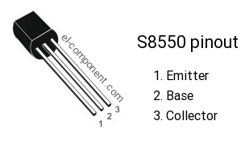

# Projekt 2. Halbjahr

Ein Projekt von Lionora Ajvazi und Melina Safari.

## Inhaltsverzeichnis
[Stundenprotokolle](#Stundenprotokolle)

[Teil1](#Teil1)

[Teilaufgaben](#Teilaufgaben)

[Seifenspender](#Seifenspender)

[Reflexion](#Reflexion)

## Stundenprotokolle

## 14. Februar 2023
In der heutigen Stunde haben wir damit angefangen, unser neues Projekt für das zweite Halbjahr auszusuchen. Wir sind uns einig, dass wir etwas mit einem Arduino bauen möchten und haben uns daher darüber informiert und uns die vorhandenen Materialien in der Schule angeguckt. Daher, dass wir für das zweite Halbjahr einen neuen Stundenplan bekommen haben, gab es zu beginn einige Komplikationen, wie bzw. wann wir anfangen. 

## 21. Februar 2023
In dieser Stunde haben wir uns geeinigt, dass wir einen "Lügendetektor" bauen möchten, welcher über die Elektrizität der Haut misst, ob jemand lügt oder nicht. Wir haben uns die Materialien angeguckt, die wir benötigen und unsere Ideen zusammengeführt. Die meisten Materialien befanden sich bereits in der Schule. 

## 28. Februar 2023
In dieser Stunde haben wir uns näher mit dem Arduino beschäftigt. Wir haben uns Zusammenhänge angeguckt und uns mit den Funktionen eines Arduinos beschäftigt. Dazu haben wir die Materialien von Herrn Buhl bekommen. Wir wussten zu beginn nicht, was ein Arduino ist und was seine zentralen Aufgaben sind. Daher haben wir uns vieles dazu angeguckt, vor allem zum Aufbau und zur Funktion. 

## 07. März 2023 
In dieser Woche haben wir nach Rücksprache mit Herrn Buhl beschlossen, dass wir bis zur ersten Abgabe Zusammenhänge des Arduinos, des Transistors usw. verstehen sollen und eigenständig Aufgaben wie das Leuchten eines LEDs mit einem Transistor durchführen sollen. Auch weitere Aufgaben haben wir besprochen und uns geeinigt, diese bis zur ersten Abgabe durchzuführen. 

## 14.März 2023
In dieser Stunde haben wir das erste mal versucht, einen LED über einen Arduino zum leuchten zu bringen. Dies konnten wir erfolgreich durchführen, Bilder dazu befinden sich in unserer folgenden Projektseite. 

## 21. März 2023
Heute haben wir uns mit dem Transistor und dem Widerstand beschäftigt. Dafür haben wir uns verschiedene Tutorials angeschaut und uns über verschiedene Webseiten informiert. Dabei haben wir herausgefunden, dass der Transistor wie ein geöffneter Schalter wirkt. Dennoch hatten wir einige Verständnisfragen bezüglich des transistors, welche wir mit Herrn Buhl klären konnten. 

## 28. März 2023
Heute haben wir größtenteils an unserer Projektseite gearbeitet, da wir in den letzten Wochen da etwas hinterher waren. Daher haben wir uns in dieser Stunde kaum mit dem Arduino beschäftigt. Wir haben größtenteils Verständnisfragen geklärt

## 05. April 2023
Der heutige Tag war der Fachtag, an dem wir uns den gesamten Tag lang mit unserem Projekt, bzw, unserem Zwischenstand beschäftigt haben. Wir haben uns sowohl weiterhin mit dem Transistor beschäftigt und uns das ziel gesetzt, über einen Transistor ein LED zun leuchten zu bringen, als auch weiter an unserer Projektseite gearbeitet. Auch weitere Aufgaben, die wir an dem Tag zu erledigen hatten, konnten wir fertigstellen (siehe Teilaufgaben). 

## 02. Mai 2023
In der heutigen Stunde haben wir unsere Projektseite nochmal überarbeitet und unsere vorher notierten Stundenprotokolle vervollständigt. 

## 17. Mai 2023
Heute hatten wir unseren zweiten Fachtag, hierbei haben wir an unserer Projektseite weitergearbeitet und uns über mehrere Quellen informiert. Des weiteren haben wir uns noch einmal genau unsere Teilaufgaben angeschaut und haben darauf hin einen Quellentext geschrieben. Schlussendlich haben wir uns geeinigt, einen Berührungslosen Seifenspender zu bauen, dabei haben wir uns zunächst auf der Quelle https://starthardware.org/beruehrungsloser-seifenspender-mit-arduino/ darüber informiert. 

## 23. Mai 2023
Heute haben wir uns näher über die einzelnen Bauteile informiert, die wir benötigen. Da all diese Materialien in der Schule vorhanden sind, können wir unsere Idee umsetzen. Wir haben zunächst damit angefangen, herauszufinden was ein Entfernungssensor und ein Servomot überhaupt sind, bzw. was deren Funktionen sind. 

## Teil1
Für dieses Projekt haben wir veschieden Bauteile benötigt wie einen Arduino, Transistor, Relais, Motor, Netzgerät, LED-Lampe, Glühlampe und einen Widerstand. Wir haben uns an erster Stelle mit diesen Bauteilen vertraut gemacht und die Funktionen dieser kennengelernt. Im folgenden erklären wir die Funktionen der entscheidensten Bauteile. 

## Arduino
Ein Arduino ist eine Physical-Computing-Plattform, welche aus einer Soft- und einer Hardware besteht. Es handelt sich um ein Steuersystem, bei dem die Ausgänge je nach Programmierung und in Abhängigkeit der Eingänge reagieren. So werden bestimmte Abläufe automatisch gesteuert. Bei der Hardware handelt es sich hier jedoch nicht um einen Computer, sondern um einen Microcontroller. 

## Transistor
Ein Transistor ist ein elektronisches Halbleiter Bauelement zum Steuern oder Verstärken niedriger elektrischer Spannungen und Ströme. Er reguliert den Strom- oder Spannungsfluss wie ein Schalter für elektronische Signale und besteht aus drei Halbleiterschichten, dem Ermitter, der Base und dem Collector. Hierbei fließt der Strom und die Spannung von dem Collector, durch die Base hin zu dem Ermitter. Bei unserem Versuch haben wir den Transistor s8550 verwendet. 

## Relais 
Ein Relais ist ein durch elektrischen Strom betriebener, fernbetätigter Schalter mit in der Regel zwei Schaltstellungen. Mit Hile von Relais von der Relais
Stromkreise ein-, aus-, und umgeschaltet werden. 

## Teilaufgaben

1. LED mit einem Arduino zum leuchten bringen

Diese Teilaufgabe konnte schnell umgesetzt werden. Der Strom wurde über den Arduino erzeugt und so konnte die LED Lampe leuchten. Je nach Sketch kann man dabei selber entscheiden, in welchem Takt, bzw. wie lange die Lampe leuchtet. 

2. LED über einen Transistor zum leuchten bringen

Das Leuchten der LED Lampe über einen Transistor war sehr ähnlich wie die erste Teilaufgabe. Der Unterschied war, dass nun der Strom von rechts nach links über den Transistor fließt. Auch der Sketch war fast der selbe wie bei der ersten Teilaufgabe. 

3. Glühlampe über einen Transistor, bzw. einem Relais zum leuchten bringen

Der Transistor hat bei dieser Teilaufgabe leider nicht so funktioniert, wie er sollte, weswegen wir auf einen Relais zurückgreifen mussten. Dieser wurde über das Netzteil an die Glühlampe angeschlossen, welche wiederrum an das Netzteil angeschlossen war. Der Strom, welcher über das Netzteil fließt, ist nämlich stärker, als der Strom vom Arduino.

4. Motor über das Netzteil laufen lassen

Bei dieser Teilaufgabe wurden die zwei längeren Kabel (blau und rot) umgesteckt, nämlich in die Öffnungen des Motors. Der sonstige Aufbau war der selbe, wie bei der dritten Teilaufgabe. 

## Seifenspender

Für das Projekt des berührungslosen Seifenspenders benötigern wir folgende Materialien: Arduino, Breadbord, Kabel, Entfernungssensor und Servomotor. Damit der Seifenspender funktionieren kann, benötigen wir theoretisch noch Seife, allerdings kann man auch Wasser oder andere ähnliche Flüßigkeiten nehmen. 

Die Schaltung sieht wie folgt aus:

## Reflexion 

Insgesamt können wir unsere ersten Erfahrungen mit dem Arduino als gelungen und Erfolgreich bewerten. Wir haben beide das erste mal mit einem Arduino gearbeitet und wollten, bzw. sollten erst einmal nur die Funktionen und Strukturen eines Arduinos herausfinden. Daher haben wir uns vorgenommen, uns mit oben genannten Teilaufgaben zu beschäftigen. Dabei haben wir dennoch Hilfe von Herrn Buhl erhalten und Tipps bekommen, wie wir welche Schritte zuerst umsetzen. 
